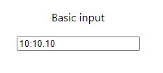

<h1 align=center>React Stopwatch Input</h1>

<p align=center>
  React Component for stopwatch times
</p>

<p align="center">
  <a href="https://github.com/ThomasMcDonald/React-Stopwatch-Input" alt="Licence" target="_blank"></a>
  <a href="https://www.npmjs.com/package/react-stopwatch-input" alt="npm version" target="_blank"></a>
</p>


<h2>Installation</h2>

```bash
npm install react-stopwatch-input
```
or
```bash
yarn add react-stopwatch-input
```

``` import StopwatchInput from 'react-stopwatch-input' ```


<h2> Example </h2>
Here's an example of basic usage:

```TSX
import React from 'react';
import './App.css';
import StopwatchInput from 'react-stopwatch-input';

function App() {
  return (
    <div className="App">
      <p>Basic input</p>
      <StopwatchInput 
        name="stopwatchInput"
        required={false}
      />
    </div>
  );
}

export default App;
```



<h2></h2>
<div align=center>
  
  Made by [Thomas McDonald](https://github.com/ThomasMcDonald).
   
  <strong>NOTE:</strong> This package was created so I could learn how to create npm packages and use git actions. Use at own risk.
</div>

